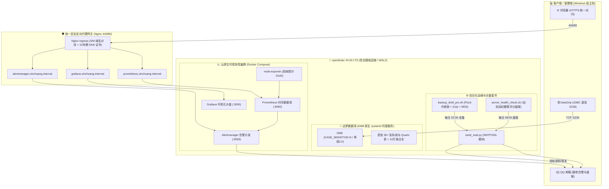
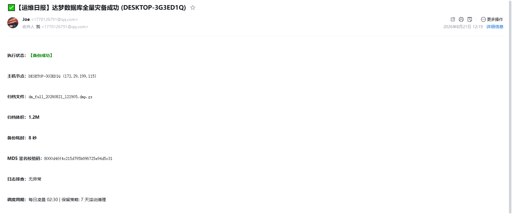
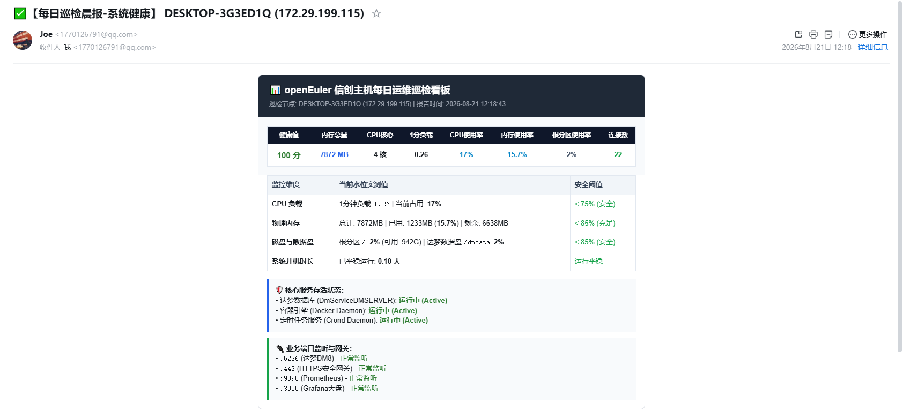

<div align="center">

# 🏛️ 企业级信创环境全栈交付与自动化容灾演练方案

### 基于 openEuler 24.03 LTS + 达梦数据库 (DM8) + 云原生监控与 Nginx 安全网关

[](https://openeuler.org/)

[](https://www.dameng.com/)

[-009639?style=for-the-badge&logo=nginx&logoColor=white)](https://nginx.org/)

[](https://prometheus.io/)

[](./LICENSE)

<p align="center">

 <b>模拟“信创国产化替代”核心交付、容灾运维与生产应急排障场景</b>

</p>

[📐 架构拓扑](#-一-架构拓扑全景图) •

[📊 性能基准](#-二-核心性能基准与实测指标) •

[🛡️ 灾备特性](#-三-工业级自动化运维与防御性设计) •

[🌐 安全网关](#-四-统一安全网关与私有-pki-体系) •

[📖 排障手册](#-五-生产排障与性能调优-runbooks) •

[📂 目录结构](#-六-仓库目录结构全貌) •

[🚀 快速启动](#-七-快速启动与演练指南)

</div>

---

> [!NOTE]
> 本项目所有方案均在 openEuler 24.03 LTS (x86_64) 与 达梦数据库 (DM8 V8.1.5) 真实单机环境中经过全流程演练与校验，符合信创等保 2.0 合规要求。

---

## 📐 一、 架构拓扑全景图



---

## 📊 二、 核心性能基准与实测指标

在单机虚拟化环境下，针对 30 张表 + 100,000 条真实操作审计日志（28.029 MB 原始数据）的实测性能矩阵：

| 评估维度 | 指标参数 / 实测表现 | 核心技术点与优势 |
| :--- | :--- | :--- |
| **逻辑全备吞吐** | 4.675 秒 (30 表 / 100,000 行) | 达梦原生 `dexp` 逻辑全量导出 |
| **归档压缩效率** | 原始 28.0 MB ➡️ 归档 1.2 MB | Gzip 流水线压缩，压缩比 85%+ |
| **全表冷读扫描** | 1,090 ms (Cold Disk I/O) | `CSCN2` 聚集索引物理全表扫描 |
| **索引范围查询** | 12 ms (Index Range Seek) | `SSEK2` 复合索引精确定位，提速 90 倍 🚀 |
| **死锁排查时效** | 1 秒内完成热解卡 | `V$TRXWAIT` 定位 9 分钟锁等待，`SP_CLOSE_SESSION` 查杀 |
| **表空间热扩容** | 128 MB 扩容至 192 MB | `ALTER TABLESPACE MAIN ADD DATAFILE` 零停机在线扩充 |
| **灾难恢复验证** | 100% 完整性验证 (`dimp`) | 单表误删演练，0 警告、0 数据丢失 |
| **安全网关证书** | 10 年超长有效期（至 2036 年） | OpenSSL 自建私有 PKI 签发，SAN 泛域名绑定，标准 443 全绿安全锁 |

---

## 🛡️ 三、 工业级自动化运维与防御性设计

- [x] 防重入内核锁保护： 引入 Linux 内核文件描述符锁（`flock -n 200`），从根源杜绝定时调度重叠引发的磁盘 I/O 拥塞与死锁；进程崩溃内核自动释放锁，无死锁残留。

- [x] 数据完整性 MD5 签名： 备份完成后毫秒级生成 `.md5` 哈希伴随文件，异地灾备机恢复前自动校验，彻底规避存储坏道与静默损坏（Bit Rot）。

- [x] 安全配置物理分离： 敏感连接凭据与 SMTP 秘钥收口于 `chmod 600` 独立配置文件，源码与密码彻底解耦。

- [x] 每日全自动健康巡检晨报： `server_health_check.sh` 采集 CPU、内存、Swap、磁盘、Inode、服务与端口状态，引入加权扣分算法输出健康分，每天 08:00 自动推送深蓝卡片式 HTML 晨报。

- [x] 全链路告警与状态闭环： 支持每日备份成功推送【运维日报】、执行失败自动捕获错误码；监控大盘在指标超标时触发【🚨紧急告警】、恢复时触发【✅已恢复】通知。

---

## 🌐 四、 统一安全网关与私有 PKI 体系

> [!TIP]
> 针对企业内网与私有云无备案域名的场景，本项目构建了基于标准 443 端口的虚拟主机路由与私有 PKI 解决方案。

1. 私有 PKI 泛域名证书： 通过 OpenSSL 自动签发包含 `*.xinchuang.internal`、`xinchuang.internal`、`localhost` 及主机 IP 的泛域名 SAN 扩展证书。

2. SNI 443 端口多域名复用： 采用模块化 `conf.d/` 隔离架构，所有 Web 应用统一汇聚于标准 `443` 端口，通过域名精准分流，80 端口自动 301 强制跳转 HTTPS。

3. 零停机平滑热重载： 结合 `nginx -t` 语法自检与 `nginx -s reload`，实现路由规则毫秒级无感生效。

---

## 📖 五、 生产排障与性能调优 Runbooks

详细排障案例与复盘手记收录于 `docs/` 目录：

* 📘 [信创基础环境与达梦部署指南](./docs/01-xinchuang-deployment-guide.md)：包含 WSL2 虚拟化定制、依赖源补齐、等保三权分立配置全流程。

* 📙 [若依业务模型迁移与方言适配手册](./docs/02-mysql-to-dameng-migration-diff.md)：深入剖析 `IDENTITY_INSERT` 避坑、CLOB/DATETIME 类型映射与批量压测设计。

* 📕 [生产事故应急排障与性能调优 Runbook](./docs/03-production-incident-runbook.md)：覆盖慢 SQL 执行计划调优、长事务行锁 `V$TRXWAIT` 查杀、表空间动态扩容与 Linux OOM 取证。

* 📗 [企业级 Nginx 统一网关与私有 PKI 实战指南](./docs/05-nginx-ssl-pki-gateway.md)：私有 CA 构建、SAN 扩展配置、Windows 根证书导入与 443 端口多域名分发全解析。

---

## 📸 项目实战交付与可观测性运行图证

以下为信创数据库与全栈可观测平台在 openEuler 环境中的真实运行成果：

### 1. 达梦数据库全量自动化容灾备份回执
每日凌晨由 crontab 调度执行，基于 Linux 内核文件锁（`flock -n 200`）与 MD5 校验完成全量冷备并发送回执：



### 2. 每日系统健康巡检晨报 HTML 大盘（100分满分）
多维动态加权巡检模块，对 CPU/内存/磁盘水位、达梦数据库服务存活与 443 安全网关进行全量体检并输出可视化晨报：



---

## 📂 六、 仓库目录结构全貌

```text

dameng-ops-lab/

├── README.md # 🏛️ 项目全景架构白皮书

├── LICENSE # 📜 Apache License 2.0 许可证

├── push.sh # 🚀 一键自动化资产归集与发布流水线

├── .gitignore # 🛡️ 敏感密钥与大文件安全过滤配置

│

├── config/ # ⚙️ 配置文件模板与容器编排

│ ├── backup_dm8.conf.example # 灾备外部凭证配置模板 (脱敏)

│ ├── docker-compose-monitoring.yml # Prometheus + Grafana + Alertmanager + Nginx 编排

│ ├── alertmanager/

│ │ └── alertmanager.yml.example # 告警路由与 SMTP 发信模板

│ ├── prometheus/

│ │ ├── prometheus.yml # 监控指标采集任务配置

│ │ └── alert.rules.yml # CPU / 内存告警阈值计算规则

│ └── nginx/

│ └── conf.d/ # Nginx 模块化域名路由配置

│ ├── 00-http-redirect.conf # 80 端口 HTTP 自动 301 跳转 HTTPS

│ ├── 01-grafana.conf # grafana.xinchuang.internal 反向代理

│ ├── 02-prometheus.conf # prometheus.xinchuang.internal 反向代理

│ └── 03-alertmanager.conf # alertmanager.xinchuang.internal 反向代理

│

├── scripts/ # 🛠️ 生产级自动化与发信工具套件

│ ├── backup_dm8_pro.sh # 达梦数据库全量灾备脚本 (带内核文件锁与 MD5)

│ ├── server_health_check.sh # 服务器每日健康巡检晨报脚本 (动态加权评分)

│ ├── send_mail.py # 基于 Python SMTP/SSL 的 HTML 邮件推送模块

│ ├── generate_ssl.sh # OpenSSL 10年期 SAN 泛域名证书一键签发工具

│ └── verify_backup_integrity.sh # 备份完整性 MD5 自动校验与解压测试工具

│

├── sql/ # 💾 业务模型、压测与 DBA 诊断脚本

│ ├── ruoyi_dm8_full_schema.sql # 若依全套 30+ 业务与 Quartz 分布式调度表 DDL

│ ├── sp_generate_mock_logs.sql # 10 万行操作审计日志批量生成存储过程

│ └── dba_troubleshooting_queries.sql # 锁等待排查、会话查杀与表空间巡检 SQL

│

└── docs/ # 📖 深度技术白皮书与排障手册 (Runbooks)

 ├── 01-xinchuang-deployment-guide.md

 ├── 02-mysql-to-dameng-migration-diff.md

 ├── 03-production-incident-runbook.md

 └── 05-nginx-ssl-pki-gateway.md

```

---

## 🚀 七、 快速启动与演练指南

### 1. 执行全量灾备并发送邮件

```bash

# 复制并配置环境凭证

cp config/backup_dm8.conf.example config/backup_dm8.conf

chmod 600 config/backup_dm8.conf

# 运行灾备脚本 (自动触发邮件)

./scripts/backup_dm8_pro.sh

```

### 2. 执行全自动系统健康巡检晨报

```bash

./scripts/server_health_check.sh

```

### 3. 启动云原生监控与 Nginx 安全网关

```bash

# 签发 10 年期 SAN 证书

./scripts/generate_ssl.sh

# 一键拉起监控大盘与统一网关

cd config

docker compose -f docker-compose-monitoring.yml up -d

```

> [!IMPORTANT]
> 部署完成后可通过以下地址访问各系统：
> * Grafana 大盘： `https://grafana.xinchuang.internal` (默认账号: `admin / admin`)
> * Prometheus 核心： `https://prometheus.xinchuang.internal`
> * Alertmanager 告警： `https://alertmanager.xinchuang.internal`
